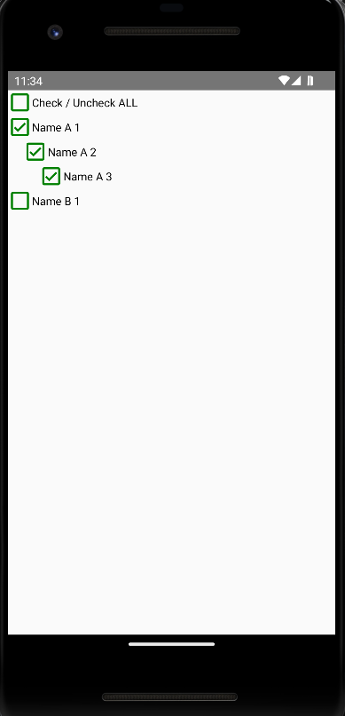
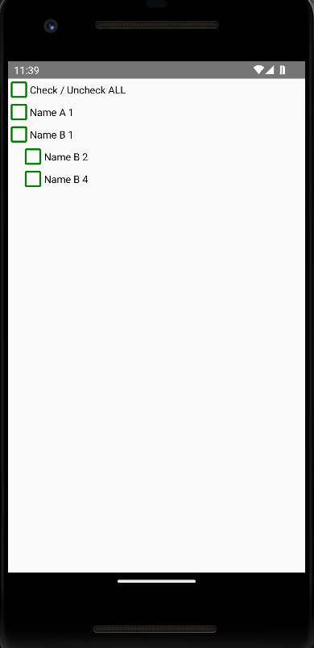

# react-native-tree-menu

React Native menu tree for nested menu or nested dropdown with selection box.

#### React/React Native App Screenshots

|  |  | |
| ---------------------------------- | ---------------------------------- | ----------------------------------------------------- |

### Install Peer Dependencies

Cherag UI uses `reaact-native-vector-icons` for icons. You must install it and configure it for your project. See its [documentation](https://github.com/oblador/react-native-vector-icons#installation) for more information about setting it up for Android, IOS or Web.

## Installation

Using Yarn:

```sh
yarn add @itsaladin/react-native-tree-menu
```

Using NPM:

```sh
npm install @itsaladin/react-native-tree-menu
```

## Usage

```js
import React, { useState } from 'react';
import { StyleSheet, View } from 'react-native';
import { MenuTree } from '@itsaladin/react-native-tree-menu';

const dataSet = [
  {
    label: 'Name A 1',
    checked: true,
    id: 1,
    childrenNodes: [
      {
        label: 'Name A 2',
        checked: true,
        id: 2,
        childrenNodes: [
          {
            label: 'Name A 3',
            checked: true,
            id: 3,
          },
        ],
      },
    ],
  },
  {
    label: 'Name B 1',
    checked: true,
    id: 4,
    childrenNodes: [
      {
        label: 'Name B 2',
        checked: true,
        id: 5,
        childrenNodes: [
          {
            label: 'Name B 3',
            checked: true,
            id: 6,
          },
        ],
      },
      {
        label: 'Name B 4',
        checked: true,
        id: 7,
        childrenNodes: [
          {
            label: 'Name B 5',
            checked: true,
            id: 8,
          },
        ],
      },
    ],
  },
];

const App = () => {
  const [data, setData] = useState(dataSet);

  return (
    <View>
      <MenuTree data={data} setData={setData} />
    </View>
  );
};
```

## Contributing

See the [contributing guide](CONTRIBUTING.md) to learn how to contribute to the repository and the development workflow.

## License

MIT

---

Made with [create-react-native-library](https://github.com/callstack/react-native-builder-bob)
